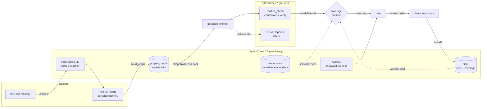

# synaptic - a SynapCores-backed intelligence layer for BitCracker V2

BitCracker V2 is fast at *checking* MultiBit Classic wallet passwords - a custom
CUDA kernel does ~11M candidates/sec. But raw speed is rarely what stands between
someone and their own forgotten wallet. The bottleneck is **judgement**: which
candidates are worth trying, and which keyspace you already swept last month.

`synaptic` puts that judgement layer in
[SynapCores Community Edition](https://synapcores.com) - an AI-native database
that unifies SQL, vector search, a property graph, in-database AutoML, and an
embedded LLM behind one REST gateway. BitCracker stays the *muscle*; SynapCores
becomes the *brain*.

> **Scope.** This is self-recovery tooling. It operates only on wallets the
> operator owns, the same category as the [btcrecover](https://github.com/gurnec/btcrecover)
> fork it builds on. The reproducible demo runs against btcrecover's **public**
> test wallet (`multibit-wallet.key`, documented password `btcr-test-password`,
> zero funds).

> **Self-contained.** This repo vendors the small MultiBit checker
> (`multibit_check.py`) and the public test wallet under `synaptic/vendor/`, so it
> installs, tests, and demos on its own - no BitCracker V2 checkout required. The
> checker is a point-in-time copy of the file from the BitCracker V2 project
> ((c) 2026 Paul Allen, GPLv2).

---

## Why this is a good fit for SynapCores

The recovery loop uses every SynapCores surface, on a real problem:

| Surface | What synaptic uses it for |
|---|---|
| **Property graph** | A knowledge graph of the owner's memory hints. GraphRAG reads it back to assemble ordered candidate tokens. |
| **Embedded LLM** | Turns free-text memory ("my dog's name and a year") into structured hints via entity extraction (optional; degrades to a deterministic tokenizer). |
| **In-database AutoML** | Trains a "password-like vs. random" classifier that ranks candidates so the search tries plausible ones first. |
| **Vector search** | Embeds candidates to flag near-duplicate variants across historical searches. |
| **SQL** | A run ledger + candidate coverage table, so a keyspace is never swept twice. |
| **MCP** | The whole loop is exposed as MCP tools, so an agent (Claude, Cursor, ...) can drive a recovery campaign conversationally. |

---

## Architecture



The default path checks the ranked, deduplicated candidate list **in-process**
via `multibit_check`'s own verifier (so ranking and coverage demonstrably reduce
work). The generated tokenlist is also written to disk so the CUDA/OpenCL tools
can take the same search at full speed.

---

## Prerequisites

1. **SynapCores CE** running locally. The dependency is codified in
   `docker-compose.yml` (works with `docker` or `podman compose`), with a
   lifecycle helper:

   ```bash
   scripts/synapcores.sh up        # start (or resume); waits for health
   scripts/synapcores.sh creds     # print the first-boot admin credentials
   ```

   Or by hand:

   ```bash
   docker compose -f synaptic/docker-compose.yml up -d
   docker compose -f synaptic/docker-compose.yml logs | grep -A 12 FIRST-BOOT
   ```

   (The image also pulls a small embedding model and an LLM on first boot.)

2. **Install synaptic** (pinned deps come from `pyproject.toml`):

   ```bash
   pip install -e "synaptic[dev]"     # runtime + pytest/ruff
   # or minimal runtime only:  pip install -r synaptic/requirements.txt
   ```

3. **Credentials in the environment** (never hard-coded; `.env` is gitignored):

   ```bash
   export SYNAPCORES_URL=http://localhost:8090
   export SYNAPCORES_PASSWORD='<admin password from the logs>'
   # or, instead of the password:  export SYNAPCORES_TOKEN='aidb_...'
   ```

### Container lifecycle & footprint (runbook)

The CE container is **CPU-bound** (it runs an embedded ~7B LLM on CPU) and uses
**several GB of RAM** - stop it when idle.

| Action | Command |
|---|---|
| Start / resume | `scripts/synapcores.sh up` |
| Health + resource usage | `scripts/synapcores.sh status` |
| First-boot credentials | `scripts/synapcores.sh creds` |
| Stop (keep data) | `scripts/synapcores.sh stop` |
| Remove container (keep data volume) | `scripts/synapcores.sh down` |

`synaptic` only needs the container running while a command actually talks to
it (the demo, `recover`, `status`, or the MCP server). It targets a **local**
instance; pointing `SYNAPCORES_URL` at a remote host requires
`SYNAPTIC_ALLOW_REMOTE=1` (see below) so candidate material isn't sent off-box by
accident.

---

## Quickstart

Run the full, reproducible demo against the public test wallet:

```bash
python -m synaptic.demo
```

Expected shape of the output:

```
== synaptic x SynapCores CE - reproducible recovery demo ==
1. Hints -> property graph (GraphRAG source of truth)
   (required) w=3 'btcr'
   (required) w=3 'test'
   (required) w=3 'password'
2. Round 1 - heuristic ranker, small budget (records what it tries)
   candidates=27 new=27 checked=8 found=False
   coverage now: {'candidates_recorded': 8, 'candidates_tried': 8, 'runs': 1}
3. Round 2 - AutoML ranker, skips round 1's coverage
   candidates=27 skipped_already_tried=8 new=19
   in-database model accuracy: 1.0
   FOUND at ranked position 1 after 1 checks
== demo complete: password recovered ==
```

Round 1 spends a small budget and **records** what it tried; round 2 switches
rankers, **skips** everything round 1 already covered, and the in-database model
puts the real password first.

### CLI

```bash
# write hints into the graph and print them back
python -m synaptic ingest synaptic/examples/demo_hints.json

# emit a btcrecover tokenlist you can also feed to the CUDA tool
python -m synaptic generate synaptic/examples/demo_hints.json --out search.txt

# run one recovery step (heuristic or in-database AutoML ranking)
# (the public test wallet is vendored under synaptic/vendor/)
python -m synaptic recover synaptic/examples/demo_hints.json \
    --wallet synaptic/vendor/test-wallets/multibit-wallet.key \
    --ranker automl

# recall what's been done
python -m synaptic runs --wallet-label btcrecover-public-test
python -m synaptic status --wallet-label btcrecover-public-test
```

The recovered password is **never** printed or stored - on success the checker's
restricted `RECOVERED_PASSWORD.txt` (owner read/write only) is written and its
path is reported.

---

## Hint sets

A hint set is your structured memory of a wallet you own. It is **candidate
password material** and is treated as sensitive: `*hints*.json` is gitignored
(only the sanitized `examples/demo_hints.json` is committed), as are generated
`synaptic_tokens_*.txt`.

```json
{
  "wallet_label": "my-old-wallet",
  "wallet_type": "multibit-classic",
  "delimiters": ["-", "_", ""],
  "hints": [
    {"text": "rex",   "kind": "name", "weight": 3, "position": 1},
    {"text": "maple", "kind": "word", "weight": 2},
    {"text": "%0,4d", "kind": "wildcard", "weight": 1, "position": 3}
  ]
}
```

* `weight >= 3` -> a **required** tokenlist line; below that -> **optional** (gets an
  empty "skip" alternative so a fragment can be absent).
* `position` (1-indexed) anchors a fragment to a slot; unpositioned hints are
  ordered by weight.
* `kind`: `word`/`name`/`place` get case variants; `literal` is exact;
  `wildcard` passes a btcrecover wildcard (e.g. `%0,4d`) through verbatim.
* `delimiters` are folded between fragments (every non-first slot offers each
  delimiter), so `["-"]` reconstructs `rex-maple-1234`.

Free-text memory can be enriched into hints (`synaptic.hints.enrich_freeform`),
using the embedded LLM's entity extraction when available and a deterministic
tokenizer otherwise.

---

## Ranking

Two interchangeable backends (`--ranker heuristic|automl`):

* **heuristic** - a structural prior over candidate shape (length, character
  classes, multi-word structure), optionally blended with embedding similarity
  to "style seeds" (example passwords you've used elsewhere). No training, no GPU.
* **automl** - trains an in-database SynapCores classifier to separate
  realistically-shaped passwords from random strings on synthetic examples, then
  scores each candidate by the model's predicted probability. The model's
  accuracy is surfaced in the run report.

Ranking only *reorders* work; it never drops a candidate, so a good password is
never lost to a bad score - just checked later.

---

## Coverage

Every candidate ever tried for a wallet is recorded by a salted SHA-256 (plaintext
is never stored). Before a run, the freshly generated candidate set is split into
*new* and *already-tried*; only the new ones are checked. Across sessions, you
never pay for the same keyspace twice. Candidate embeddings additionally back an
advisory "semantic near-duplicate" report.

---

## MCP server

Expose the loop to an agent:

```jsonc
// claude_desktop_config.json
{
  "mcpServers": {
    "synaptic": {
      "command": "python",
      "args": ["-m", "synaptic.mcp_server"],
      "cwd": "/path/to/BitCracker_V2",
      "env": {
        "SYNAPCORES_URL": "http://localhost:8090",
        "SYNAPCORES_PASSWORD": "..."
      }
    }
  }
}
```

Tools: `sc_status`, `sc_ingest_hints`, `sc_generate_tokenlist`,
`sc_run_recovery`, `sc_coverage_report`, `sc_recall_runs`. No password is ever
returned through a tool. Transport is newline-delimited JSON-RPC 2.0 over stdio,
implemented with the standard library only.

---

## Tests

```bash
pip install -r synaptic/requirements.txt
ruff check --config synaptic/ruff.toml synaptic/
python -m pytest synaptic/tests/           # DB-free unit tests (what CI runs)

# opt-in end-to-end against a live instance:
SYNAPTIC_LIVE=1 SYNAPCORES_URL=... SYNAPCORES_PASSWORD=... \
  python -m pytest synaptic/tests/test_integration.py
```

---

## Field notes: SynapCores CE v1.6.5.x

Built against a live CE instance; a few surface details differed from the OpenAPI
document and are worth flagging (the client encapsulates all of them):

* `/v1/query/execute` **rejects `$1` bound parameters** - values must be inlined.
  synaptic centralizes safe SQL literal quoting in `client.sql_literal` and only
  ever quotes values it generated itself.
* Vector payloads carry the embedding under **`values`**, and search under
  **`vector`**; collection creation wants **`dimensions`** (plural).
* Graph edges use **`src`/`dst`/`type`**; the graph is the tenant's single
  implicit graph (a `graph` name is rejected). `/v1/graph/match` takes its Cypher
  under the **`sql`** field.
* AutoML: `dataset_type` is the task family (`classification`, ...); `train` needs
  `target` + `collection`; **feature and target columns must be numeric**;
  `predict` takes **`inputs: [ {col: val} ]`** and returns `{predictions: [...] }`.
* **`DELETE` hides rows from queries but does not release keys from a PRIMARY KEY
  index**, so a deleted-then-reinserted key fails permanently. synaptic avoids a
  PK on the high-churn candidate table and enforces idempotency in the app layer;
  a full reset uses `DROP TABLE` (which does clear the index).
* `ON CONFLICT ... DO UPDATE` cannot reference the existing row
  (`sc_candidates.tried`) and some aggregate functions are unavailable in the
  conflict/"sync" context.

None of these are blockers - they're the kind of rough edges a design partner
would surface in week one.
